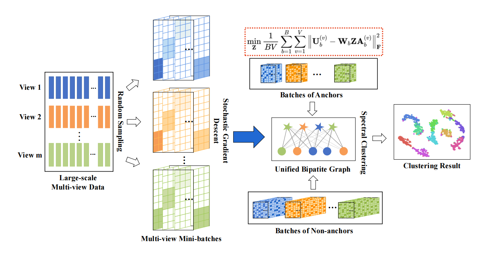

# Minibatch Anchor Graph for Large-scale Multi-view Clustering

The demo code for the "Mini-batch Meets Anchor Graphs: An Efficient Graph Learning Method for Large-scale Multi-view Clustering" (Under Review).

Large-scale multi-view clustering (LMVC) has been a long-standing challenge in multi-view learning, where traditional algorithms fail to handle millions or billions of data points due to their high computational cost. To tackle large-scale datasets, anchor graph techniques have been the prominent methods, which significantly reduce the time and space complexity to linear complexity. Among them, the learned anchors and centroid-based anchors have been well-studied, for which we focus on the sampled anchors in this study. To enhance both anchor diversity and training efficiency, we pack a set of randomly sampled anchors into a mini-batch to train a unified anchor graph, which is also shared across multiple views. We observe that learning a unified anchor graph from anchor mini-batches not only converges rapidly but also induces a high-quality anchor graph. Extensive experiments on eight large-scale datasets prove the superiority of our method compared with six advanced baselines.
